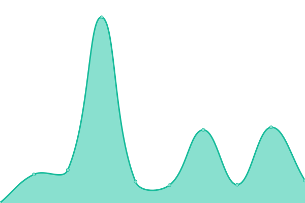
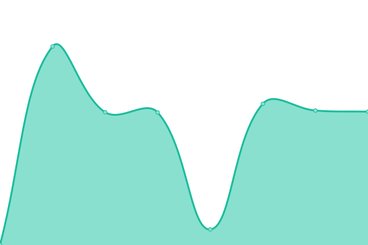
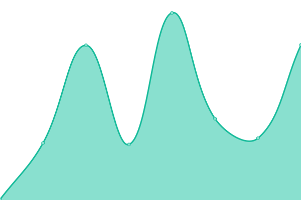
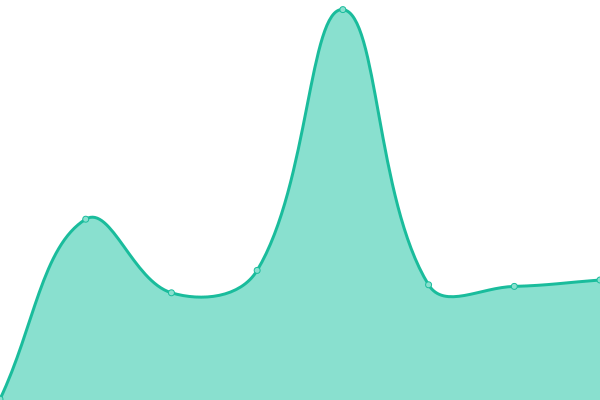
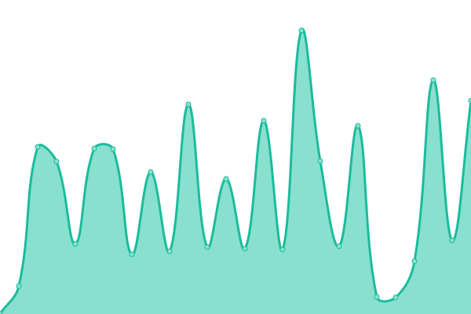
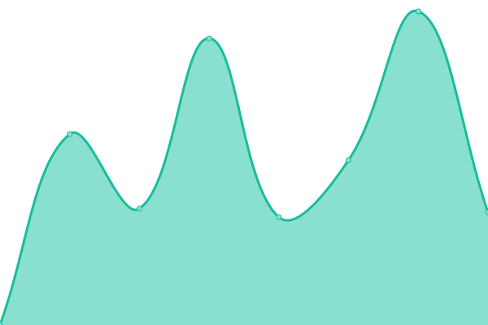

# [📈 Live Status](https://upptime.leftlane.io): <!--live status--> **🟧 Partial outage**

This repository contains the open-source uptime monitor and status page for [Chris Dixon](https://upptime.leftlane.io), powered by [Upptime](https://github.com/upptime/upptime).

With [Upptime](https://upptime.js.org), you can get your own unlimited and free uptime monitor and status page, powered entirely by a GitHub repository. We use [Issues](https://github.com/chriswdixon/upptime-monitor/issues) as incident reports, [Actions](https://github.com/chriswdixon/upptime-monitor/actions) as uptime monitors, and [Pages](https://upptime.leftlane.io) for the status page.

<!--start: status pages-->
<!-- This summary is generated by Upptime (https://github.com/upptime/upptime) -->
<!-- Do not edit this manually, your changes will be overwritten -->
<!-- prettier-ignore -->
| URL | Status | History | Response Time | Uptime |
| --- | ------ | ------- | ------------- | ------ |
|  [LeftLane.IO](https://leftlane.io) | 🟩 Up | [left-lane-io.yml](https://github.com/chriswdixon/upptime-monitor/commits/HEAD/history/left-lane-io.yml) | 

 193ms
     
 | 

<a href="https://upptime.leftlane.io/history/left-lane-io">100.00%</a>
    

|  [3dvirtualtoursaustin](https://3dvirtualtoursaustin.com) | 🟩 Up | [3dvirtualtoursaustin.yml](https://github.com/chriswdixon/upptime-monitor/commits/HEAD/history/3dvirtualtoursaustin.yml) | 

 261ms
     
 | 

<a href="https://upptime.leftlane.io/history/3dvirtualtoursaustin">100.00%</a>
    

|  [efrensanchez.com](https://efrensanchez.com) | 🟩 Up | [efrensanchez-com.yml](https://github.com/chriswdixon/upptime-monitor/commits/HEAD/history/efrensanchez-com.yml) | 

 254ms
     
 | 

<a href="https://upptime.leftlane.io/history/efrensanchez-com">100.00%</a>
    

|  [EPIC Project Management](https://www.epicpmgroup.com) | 🟩 Up | [epic-project-management.yml](https://github.com/chriswdixon/upptime-monitor/commits/HEAD/history/epic-project-management.yml) | 

 457ms
     
 | 

<a href="https://upptime.leftlane.io/history/epic-project-management">100.00%</a>
    

|  [fridaysoutside.com](https://fridaysoutside.com) | 🟩 Up | [fridaysoutside-com.yml](https://github.com/chriswdixon/upptime-monitor/commits/HEAD/history/fridaysoutside-com.yml) | 

 402ms
     
 | 

<a href="https://upptime.leftlane.io/history/fridaysoutside-com">100.00%</a>
    

|  [Housegals.com](https://housegals.com) | 🟩 Up | [housegals-com.yml](https://github.com/chriswdixon/upptime-monitor/commits/HEAD/history/housegals-com.yml) | 

 242ms
     
 | 

<a href="https://upptime.leftlane.io/history/housegals-com">100.00%</a>
    

|  [Human Bonding Foundation](https://humanbonding.org) | 🟩 Up | [human-bonding-foundation.yml](https://github.com/chriswdixon/upptime-monitor/commits/HEAD/history/human-bonding-foundation.yml) | 

 2302ms
     
 | 

<a href="https://upptime.leftlane.io/history/human-bonding-foundation">100.00%</a>
    

|  [Hutto Infinity Athletics](https://huttoinfinityathletics.com) | 🟩 Up | [hutto-infinity-athletics.yml](https://github.com/chriswdixon/upptime-monitor/commits/HEAD/history/hutto-infinity-athletics.yml) | 

 255ms
     
 | 

<a href="https://upptime.leftlane.io/history/hutto-infinity-athletics">100.00%</a>
    

|  [Jackson, Sjoberg LLP](https://jacksonsjoberg.com) | 🟩 Up | [jackson-sjoberg-llp.yml](https://github.com/chriswdixon/upptime-monitor/commits/HEAD/history/jackson-sjoberg-llp.yml) | 

 407ms
     
 | 

<a href="https://upptime.leftlane.io/history/jackson-sjoberg-llp">100.00%</a>
    

|  [Kahanak Master Builder](https://kahanek.net) | 🟥 Down | [kahanak-master-builder.yml](https://github.com/chriswdixon/upptime-monitor/commits/HEAD/history/kahanak-master-builder.yml) | 

 768ms
     
 | 

<a href="https://upptime.leftlane.io/history/kahanak-master-builder">100.00%</a>
    

|  [Pflugerville Tours](https://pflugervilletours.com) | 🟩 Up | [pflugerville-tours.yml](https://github.com/chriswdixon/upptime-monitor/commits/HEAD/history/pflugerville-tours.yml) | 

 259ms
     
 | 

<a href="https://upptime.leftlane.io/history/pflugerville-tours">100.00%</a>
    

|  [Remembering Ryan Sheehan](https://www.rememberingryansheehan.com) | 🟩 Up | [remembering-ryan-sheehan.yml](https://github.com/chriswdixon/upptime-monitor/commits/HEAD/history/remembering-ryan-sheehan.yml) | 

 905ms
     
 | 

<a href="https://upptime.leftlane.io/history/remembering-ryan-sheehan">100.00%</a>
    

|  [SOS Austin](https://sos-austin.org) | 🟩 Up | [sos-austin.yml](https://github.com/chriswdixon/upptime-monitor/commits/HEAD/history/sos-austin.yml) | 

 286ms
     
 | 

<a href="https://upptime.leftlane.io/history/sos-austin">100.00%</a>
    

|  [Stars Vipers](https://starsvipers.com) | 🟩 Up | [stars-vipers.yml](https://github.com/chriswdixon/upptime-monitor/commits/HEAD/history/stars-vipers.yml) | 

 1304ms
     
 | 

<a href="https://upptime.leftlane.io/history/stars-vipers">100.00%</a>
    

|  [True A Med Spa](https://trueamedspa.com) | 🟩 Up | [true-a-med-spa.yml](https://github.com/chriswdixon/upptime-monitor/commits/HEAD/history/true-a-med-spa.yml) | 

 228ms
     
 | 

<a href="https://upptime.leftlane.io/history/true-a-med-spa">100.00%</a>
    

|  [TX BMX Hall of Fame](https://txbmxhof.org) | 🟩 Up | [tx-bmx-hall-of-fame.yml](https://github.com/chriswdixon/upptime-monitor/commits/HEAD/history/tx-bmx-hall-of-fame.yml) | 

 221ms
     
 | 

<a href="https://upptime.leftlane.io/history/tx-bmx-hall-of-fame">100.00%</a>
    

|  [TX CPA Consulting](https://txcpaconsulting.com) | 🟩 Up | [tx-cpa-consulting.yml](https://github.com/chriswdixon/upptime-monitor/commits/HEAD/history/tx-cpa-consulting.yml) | 

 237ms
     
 | 

<a href="https://upptime.leftlane.io/history/tx-cpa-consulting">100.00%</a>
    

<!--end: status pages-->

[**Visit our status website →**](https://upptime.leftlane.io)

## 📄 License

- Powered by: [Upptime](https://github.com/upptime/upptime)
- Code: [MIT](./LICENSE) © [Chris Dixon](https://upptime.leftlane.io)
- Data in the `./history` directory: [Open Database License](https://opendatacommons.org/licenses/odbl/1-0/)
